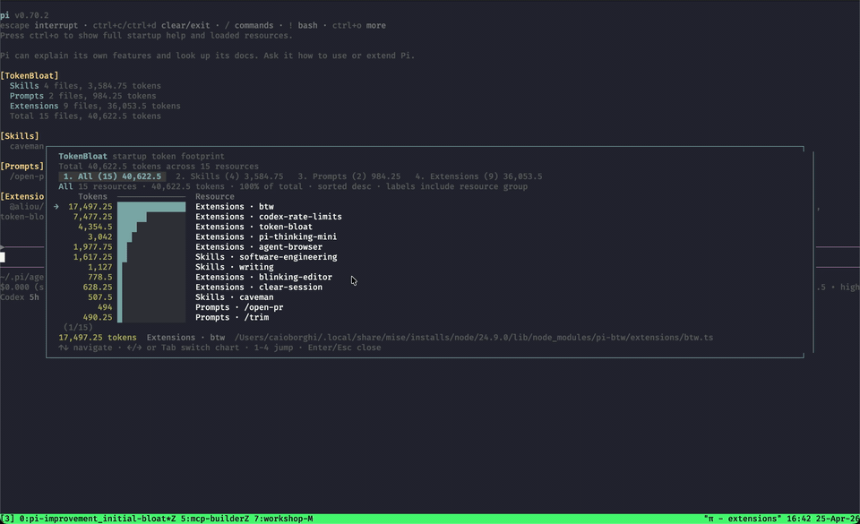

# TokenBloat

TokenBloat is a Pi extension that estimates the LLM context footprint of loaded Pi resources.

It focuses on what can actually reach the model, not extension source size. Extension implementation code, slash-command handlers, and UI code are not counted unless an extension registers an active tool whose metadata is sent to the model.



## What it counts

- **System prompt**: approximate tokens for Pi's assembled system prompt when available.
- **Last provider payload**: approximate tokens for the last serialized provider request when available. This includes conversation history, so it is broader than startup resource cost.
- **Context files**: `AGENTS.md`, `CLAUDE.md`, and other context files that Pi includes in the system prompt when available.
- **Skills**: only the skill catalog that Pi inserts into the system prompt: skill name and description. Full `SKILL.md` files are loaded on demand and are shown as source size only.
- **Prompts**: full template size. Prompt templates are slash-command expansions, so these tokens enter model context only when invoked.
- **Extensions**: only active extension tool schemas/descriptions. Extension source, commands, shortcuts, and UI are not sent to the model.

Token counts are approximate (`chars / 4`), but the counted inputs now match Pi's context behavior much more closely than raw file-size totals.

## Features

- Adds a compact startup summary above the editor.
- Shows actual-ish system prompt size when Pi exposes it.
- Separates always-in-context resource metadata from on-demand prompt/skill content.
- Provides `/token-bloat` for an interactive chart.
- Defaults to an `All` chart across context files, skills, prompts, and extensions.
- Keeps per-group charts for focused inspection.

## Install

Install from npm:

```bash
pi install npm:@ocodista/pi-token-bloat
```

Install from GitHub:

```bash
pi install git:github.com/ocodista/pi-token-bloat
```

Try it without installing:

```bash
pi -e git:github.com/ocodista/pi-token-bloat
```

## Use

Start Pi after installing the package. TokenBloat briefly shows the startup summary above the editor. After `/reload`, it shows the summary again.

Open the detailed view:

```text
/token-bloat
```

Configure the startup summary:

```text
/token-bloat:settings
```

In the chart:

- Use `↑` and `↓` to move.
- Use `←`, `→`, or `Tab` to switch charts.
- Use number keys to jump to a chart.
- Press `Enter` or `Esc` to close.

## Accuracy notes

TokenBloat is an estimator, not a billing-grade tokenizer.

The most important behavior change is that extension files are no longer treated as prompt context. For example, a command-only or UI-only extension should show `0` extension tokens, because Pi loads it into the Node runtime rather than sending its source to the model.

Prompt templates are shown by full template size even though they are on-demand. This helps identify large prompts before you invoke them.

Extension token cost appears only when the extension registers active tools, because tool names, descriptions, and schemas are part of the model-facing tool interface.

## Development

Run a local copy directly:

```bash
pi -e ./index.ts
```

Check the npm package contents:

```bash
npm run pack:dry-run
```

Run TypeScript locally after installing dev dependencies:

```bash
npm install
npm run typecheck
```

## Security

Pi extensions run with your system permissions. Review packages before installing them.
